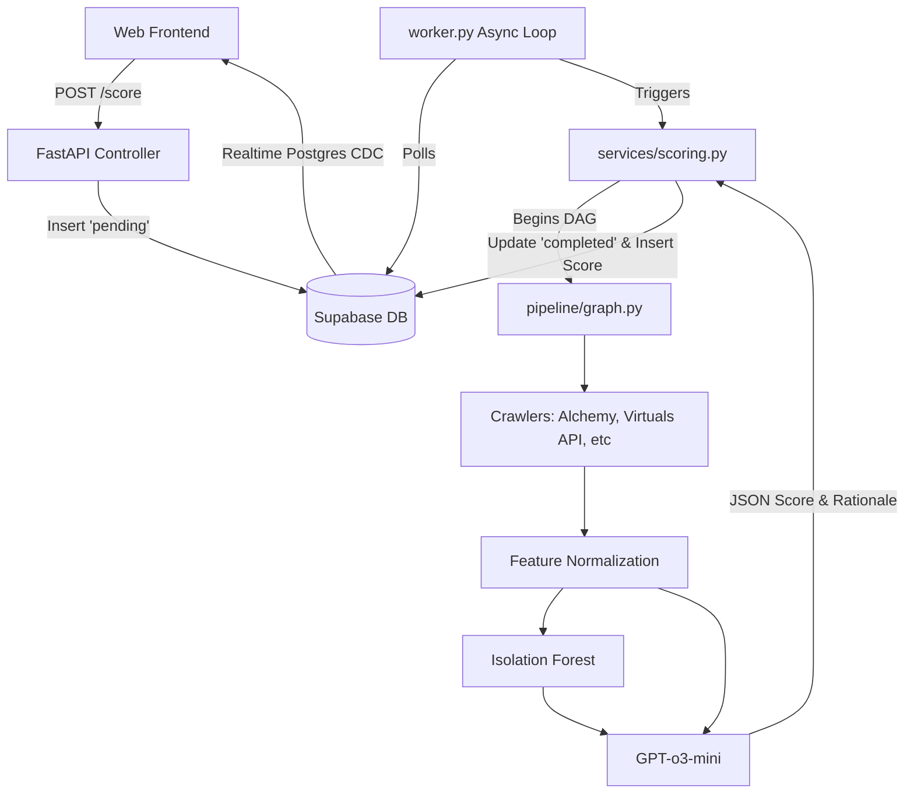

# AgentScore Backend Architecture

This document breaks down the internal architecture, data models, and service layer flow of the AgentScore backend so it can be accurately reconstructed.

## 1. System Components

The backend follows a classic 3-tier REST architecture augmented by an asynchronous job queue and a DAG-based Machine Learning pipeline.

### A. API Layer (`app/api/`)
FastAPI routers act purely as controllers. They receive HTTP requests, parse inputs using Pydantic, and immediately hand off execution to the Service Layer.
- **`score.py`**: Handles synchronous reads from Supabase and asynchronous queuing by inserting rows into `score_requests`.
- **`agents.py`**: Basic CRUD for agent profiles.
- **`leaderboard.py`**: Read-only queries against optimized Supabase views.

### B. Service Layer (`app/services/`)
- **`supabase.py`**: Wraps the `supabase-py` client. Uses a custom lazy-loading proxy so that the connection isn't initialized before `config.py` has loaded the `.env` file during startup. Exposes helper functions like `get_latest_score`, `update_request_status`, and `get_agents`.
- **`scoring.py`**: The orchestration layer. It triggers the LangGraph pipeline, receives the final calculated score and 22-signal vector, and executes the SQL `UPSERT` commands to write to the `agent_features` and `scores` tables.
- **`anomaly.py`**: Uses `scikit-learn`'s `IsolationForest` to analyze the 22-signal vector against historical baselines to flag potentially manipulative on-chain behavior.

### C. Pipeline Layer (`app/pipeline/`)
The core ML logic utilizes **LangGraph** to construct a deterministic, multi-step pipeline for evaluating an agent.
- **`state.py`**: Defines `AgentScoreState`, a `TypedDict` that holds the state as it passes between nodes (wallet address, raw data, computed features, final score).
- **`graph.py`**: Wires the directed acyclic graph (DAG) sequentially.
- **`nodes.py`**: Contains the individual Python functions for each step:
  - `node_init`
  - `node_fetch_base_rpc` (Hits Alchemy)
  - `node_fetch_virtuals`, `..._olas`, `..._fetch`, `..._erc8004` (Hits respective external APIs via logic in `app/crawlers/`)
  - `node_check_ensip25` (Validates agent ownership and capabilities text records inside ENS)
  - `node_compute_features` (Mathematical normalization of raw JSON API data into exactly 22 floating-point values between 0-100)
  - `node_gpt_score` (Packages the 22 signals into a JSON prompt and sends to OpenAI GPT-o3-mini for a qualitative text analysis and 0-1000 grade).
- **`prompt.py`**: Stores the heavy system prompts directing GPT-o3 on how to interpret the signals as a "Credit Bureau Examiner".

### D. Asynchronous Job Worker (`worker.py`)
Because LLM inference and 5+ third-party API crawls can take 10-60 seconds, scoring is detached from the HTTP request cycle.
- The `POST /v1/score` endpoint inserts a row into the `score_requests` table with status `pending`.
- `worker.py` runs as a separate Python process. It polls the Supabase table every `{WORKER_POLL_INTERVAL}` seconds using `asyncio`.
- It picks up jobs, processes them using `services.scoring.score_agent()`, and sets the status to `completed` or `failed`.
- It uses `asyncio.Semaphore({WORKER_MAX_CONCURRENT})` to prevent hitting OpenAI or Alchemy API rate limits.

---

## 2. Platform Architecture Diagram

---

## 3. Core Database Entities

The relational database architecture requires these specific table structures in PostgreSQL (via Supabase):

### `agents`
Tracks the global metadata of an agent.
- `wallet_address` (text, PK)
- `name` (text)
- `platform` (text)
- `ens_name` (text, nullable)
- `avatar_url` (text, nullable)
- `created_at` (timestamptz, default now)

### `scores`
Append-only ledger of every historical score generated.
- `id` (uuid, PK, default gen_random_uuid)
- `wallet_address` (text, FK agents)
- `agent_id` (text, nullable)
- `platform` (text)
- `score` (int2)
- `tier` (text) — Enforced constraints: 'S', 'A', 'B', 'C', 'D'
- `rationale` (text)
- `key_factors` (jsonb)
- `risk_flags` (jsonb)
- `model_used` (text)
- `anomaly_score` (float8)
- `is_anomaly` (boolean)
- `ensip25_verified` (boolean)
- `onchain_tx_hash` (text, nullable)
- `pipeline_error` (text, nullable)
- `started_at` (timestamptz)
- `created_at` (timestamptz)

### `score_requests`
Queue state management. 
- `id` (uuid, PK)
- `wallet_address` (text)
- `status` (text) — Enforced constraints: 'pending', 'processing', 'completed', 'failed'
- `priority` (text)
- `requested_by` (text)
- `attempts` (int2, default 0)
- `error` (text, nullable)
- `score_id` (uuid, FK scores, nullable)
- `created_at` (timestamptz)
- `updated_at` (timestamptz)
- `completed_at` (timestamptz, nullable)

### `agent_features`
Stores the exact 22-signal vector that generated the score, used for retraining ML models.
- `wallet_address` (text, PK)
- `agent_id` (text, nullable)
- `platform` (text)
- `features` (jsonb)
- `raw_data` (jsonb)
- `anomaly_score` (float8)
- `is_anomaly` (boolean)
- `scored_at` (timestamptz)
- `pipeline_error` (text, nullable)
